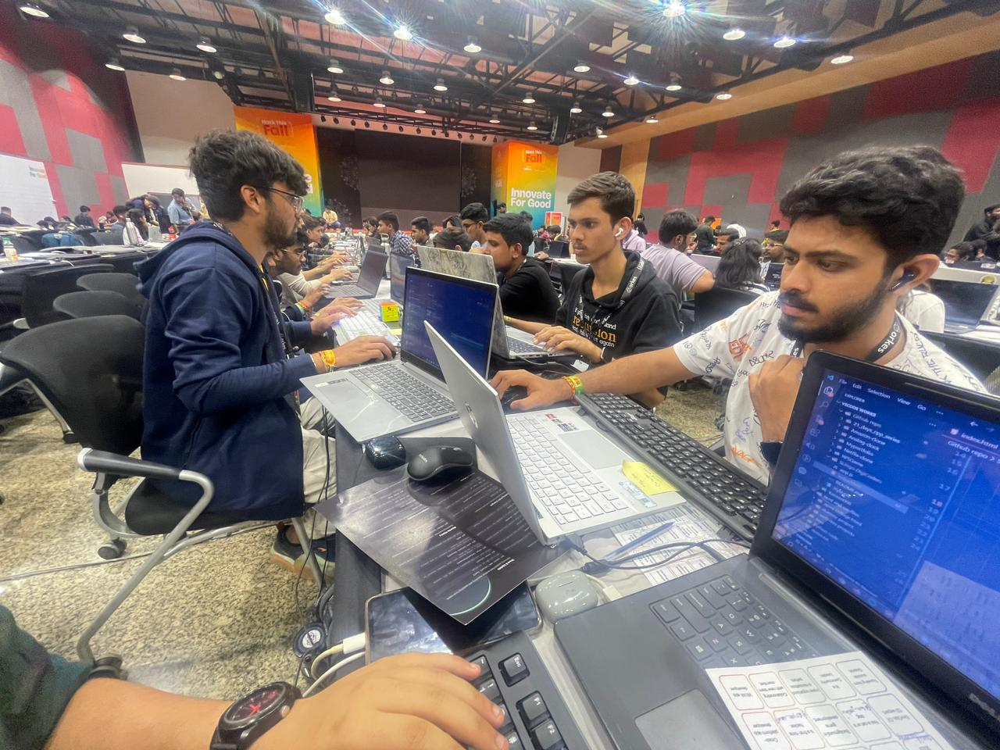
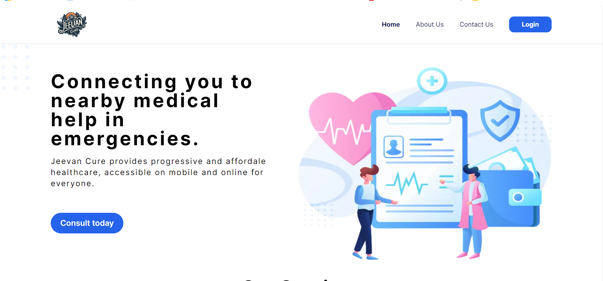
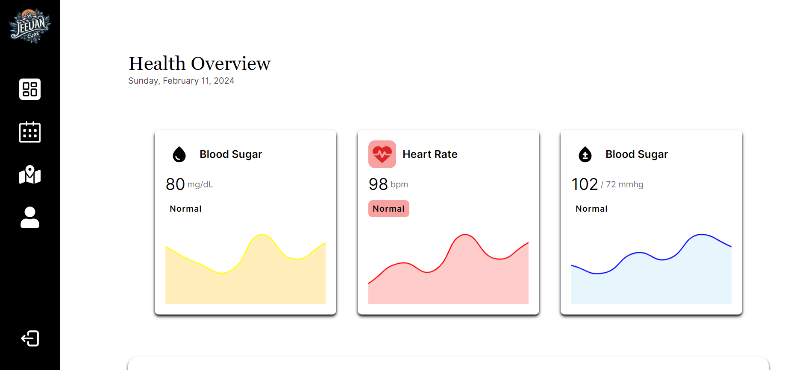
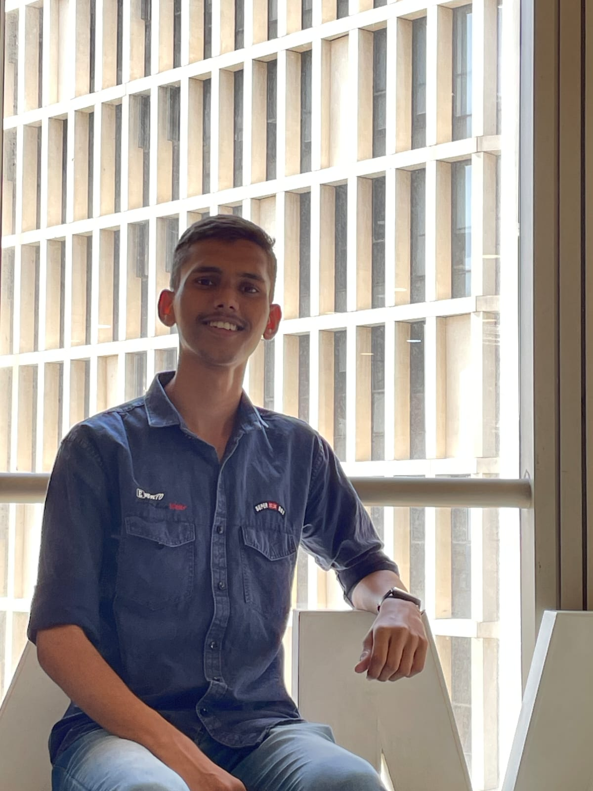

<div align="center"> 

# Hack This Fall🧡🤗 !!

</div>

<p align="center"> </p>
<div align="center">

# Team Name - The Event Listener (Team-610) 👨‍💻

 

</div> 

## **Project Name:- Jeevan Cure** 🏥

## 🌟 About the Project [](https://github.com/K-Khushal/Jeevan_Cure)

💡 What comes to mind when you hear "Jeevan Cure"? Perhaps a solution or treatment aimed at restoring health? That's exactly what we're about! Jeevan Cure symbolizes a path toward a healthier life. 🌱

Our mission is to provide a lifeline  in medical emergencies by connecting you to the nearest healthcare facilities.

With Jeevan Cure, help is always just a click away! 🖱️

Join us on this journey towards a healthier and safer life with Jeevan Cure. 🌍💖


## *Tagline* 

### "Healthcare at your fingertips. Anytime, anywhere."
### #Life_Saviour

<br>

## _Problem Statement_  ⁉

>In times of medical emergencies, finding the nearest healthcare facilities can be challenging and time-consuming. There is a need for a solution that can provide immediate assistance by connecting individuals to the nearest healthcare facilities.

## _What solution💡 we can build !!_

>Jeevan Cure's web app swiftly connects users to nearby healthcare facilities during emergencies. Users click for help, and the app detects their location, showing nearby facilities. It offers immediate medical advice through telemedicine services and values user feedback for continuous improvement. Collaborations with healthcare providers ensure timely assistance. Join us for accessible support.

## Some visual captures of our project 📸 
<div align="center">


<br>


</div> 

## ⚡️ Tech Stacks

We have used some tech stacks like 👇

* Next.js (Frontend)
* Clerk.com (Authentication)
* Vonage API's (SMS API)
* Postman (API Testing)
* Github (Version Control)
* Mapples (Map API)


## Tracks we use are as follows❗

>_Open Source-Innovation 💡_ (Open Thinker😇🚀)


## Applicable Tracks for our Project🖥️!!

* Built with Vonage Api's.
* Best use of GitHub.
* Creative Message on Linkedin,Youtubeand Twitter.
* Postman for Api's.
* Best domain Name for Goo Daddy Register

## Installation Steps 📌

1. Clone the repository

```bash
https://github.com/K-Khushal/Jeevan_Cure.git
```

2. Change the working directory

```bash
cd Jeevan_Cure
```

3. Install dependencies

```bash
npm install
```

4. Run the app

```bash
npm run dev
```

## Contributors

<table>
  <tr>
    <td align="center"><a href="https://github.com/gajjararyan"><br /><sub><b>Aryan Gajjar</b></sub></a><br /> <br /><a href="https://www.linkedin.com/in/aryangajjar/" alt="Linkedin"></a> <a href="mailto:gajjararyan1509@gmail.com" alt="Contact me"></a>  <a href="https://linktr.ee/aryangajjar" alt="My site"></a></td>
    <td align="center"><a href="https://github.com/K-Khushal"><br /><sub><b>Khushal Khandelwal</b></sub></a><br /> <br /><a href="https://www.linkedin.com/in/khushal-khandelwal/" alt="Linkedin"></a> <a href="mailto:khandelwalkhushal79@gmail.com" alt="Contact me"></a>  <a href="https://beacons.ai/khushalk" alt="My site"></a></td>
    <td align="center"><a href=""><br /><sub><b>Harsh Parekh</b></sub></a><br /><br /> <a href="https://www.linkedin.com/in/harsh-parekh-6b068025b/" alt="Linkedin"></a> <a href="mailto:aparekh.haresh@gmail.com" alt="Contact me"></a>  <a href="https://beacons.ai/hap_404" alt="My site"></a></td>
  </tr>
</table>
